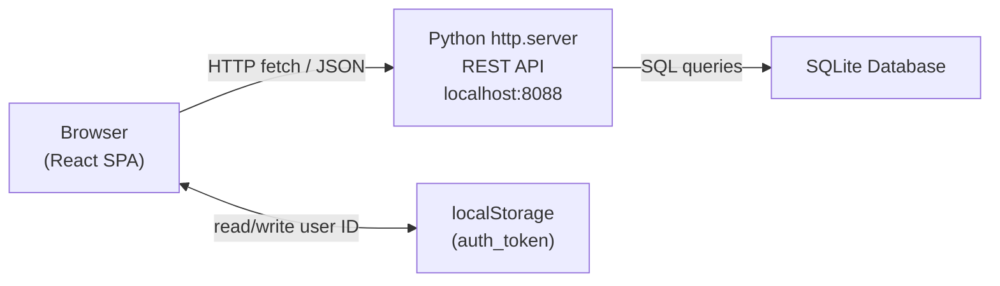

<!-- Last updated: 2026-05-03 -->
<!-- Last change: Initial architecture document (reverse-engineered from codebase) -->

# Rare: The Publishing Platform - Technical Architecture

## System Overview

Rare is a two-repository full-stack application. This repo is the React frontend (client).
It communicates over HTTP with a separate Python backend API that serves JSON from a
SQLite database. Both run locally during development.



**Repositories:**
- Frontend (this repo): https://github.com/Evening-Cohort-31/Rare-for-Python-client-fljqvv
- Backend API: https://github.com/Evening-Cohort-31/Rare-for-Python-api-fljqvv

## Codebase Map

```
src/
├── index.js                      # App entry point; mounts React tree
├── Rare.js                       # Root component; manages auth token state
├── Rare.css / index.css          # App-level and global styles
├── serviceWorker.js              # CRA boilerplate; not actively used
│
├── context/
│   ├── CurrentUserContext.js     # React context object definition
│   └── CurrentUserContext.jsx    # Provider component and useCurrentUser hook
│
├── views/
│   ├── ApplicationViews.js       # All route definitions (React Router v6)
│   └── Authorized.js             # Route guard: redirects unauthenticated users
│
├── managers/
│   └── AuthManager.js            # Login and register fetch calls (pre-service pattern)
│
├── services/
│   ├── apiSettings.js            # Base URL + shared fetch helpers (fetchJson, etc.)
│   ├── index.js                  # Re-exports all services for clean imports
│   ├── PostService.js            # Post CRUD
│   ├── UserService.js            # User CRUD
│   ├── CategoryService.js        # Category CRUD
│   ├── CommentService.js         # Comment CRUD
│   ├── ReactionService.js        # Reaction type lookups
│   ├── PostReactionService.js    # User reactions on posts (upsert pattern)
│   ├── TagService.js             # Tag CRUD
│   ├── PostTagsService.js        # Post-tag join table operations
│   ├── SubscriptionService.js    # Follow/subscribe to authors
│   ├── ImageService.js           # Avatar lookups and profile image uploads
│   └── DemotionQueue.js          # Multi-admin demotion approval workflow
│
├── components/
│   ├── auth/                     # Login, Register, Authorized guard, StaffOnly guard
│   ├── categories/               # Category list, new, edit
│   ├── comments/                 # Comment list, edit, post-level comment view
│   ├── nav/                      # NavBar
│   ├── posts/                    # Post list, detail, form, new, edit, filter, approve
│   ├── reactions/                # Reaction bar, picker dialog, create form
│   ├── tags/                     # Tag list, new, edit
│   ├── users/                    # User profiles, user detail, subscribe button, modals
│   └── utils/                    # HumanDate formatter, imageUtils helpers
│
├── design/
│   ├── index.js                  # Re-exports all design system components
│   ├── design.css                # Design system styles
│   ├── Button.js, Card.js, ...   # Reusable UI primitives wrapping Bulma classes
│   └── bulma-reference/          # Bulma demo components (dev reference; not used in production)
│
└── bulma/                        # Older duplicate of bulma-reference; superseded by design/
```

## Entry Points

1. `src/index.js` creates the React root and wraps the entire tree in three providers:
   `<BrowserRouter>`, `<CurrentUserProvider>`, and `<Rare>`.
2. `src/Rare.js` reads `auth_token` from `localStorage` on mount, holds it in state,
   and renders `<NavBar>` and `<ApplicationViews>` with the token passed as a prop.
3. `<CurrentUserProvider>` runs a `useEffect` on mount: if an `auth_token` exists in
   `localStorage`, it fetches the full user object from `GET /users/:id` and stores it
   in context. This is what populates `currentUser` throughout the app.
4. `src/views/ApplicationViews.js` registers all routes. Unauthenticated routes (login,
   register, access-denied) are public. Everything else is wrapped in `<Authorized>`,
   and staff-only pages are additionally wrapped in `<StaffOnly>`.

## Component Breakdown

### Auth Guards
- **`Authorized`**: Reads `currentUser` from context. Redirects to `/login` if no user
  is present; otherwise renders child routes via `<Outlet>`.
- **`StaffOnly`**: Same as `Authorized` but additionally checks `currentUser.is_staff`.
  Redirects to `/access-denied` if the user is not staff.

### Current User Context
Provides `currentUser`, `setCurrentUser`, `isLoading`, and `fetchUserData` to the
entire component tree. Components call `useCurrentUser()` to access the logged-in user
without prop drilling.

### Services Layer
All API communication goes through `src/services/`. The pattern:
1. `apiSettings.js` defines the base URL and four shared helpers:
   `fetchJson` (GET), `postJson` (POST), `putJson` (PUT), `deleteJson` (DELETE).
2. Domain service files (e.g., `PostService.js`) call these helpers with specific
   endpoints and return the resulting promises.
3. `services/index.js` re-exports everything so components import from one place:
   `import { getAllPosts, createPost } from "../services"`.

**Note:** `AuthManager.js` predates this pattern and calls `fetch` directly instead of
using the shared helpers. It is not re-exported from `services/index.js`.

### Design System
`src/design/` is a set of thin wrapper components (Button, Card, FormField, etc.) that
apply Bulma CSS classes. This keeps Bulma class names out of feature components and
provides a single place to update styling tokens. The `bulma-reference/` subdirectory
holds demo/reference components used during development; it is not part of the production UI.

### Admin: Demotion Queue
The demotion queue is a custom workflow to prevent accidentally removing the last admin.
When one admin initiates a demotion of another, an entry is created in `/demotionqueue`
with `status: pending`. A second admin must confirm before the demotion takes effect.
This logic lives in `DemotionQueue.js` and the `ChangeUserTypeModal` component.

## Data Model

The schema below is inferred from the frontend service layer. The authoritative schema
lives in the backend repo. Field names and exact types may differ slightly.

```dbml
Table users {
  id integer [pk]
  username varchar [not null, unique]
  password varchar [not null]
  is_staff boolean [default: false]
  active boolean [default: true]
  bio text
  profile_image_url varchar
  created_on date
}

Table posts {
  id integer [pk]
  user_id integer [ref: > users.id]
  category_id integer [ref: > categories.id]
  title varchar [not null]
  content text [not null]
  image_url varchar
  publication_date date
  approved boolean [default: false]
}

Table categories {
  id integer [pk]
  label varchar [not null, unique]
}

Table tags {
  id integer [pk]
  label varchar [not null, unique]
}

Table post_tags {
  id integer [pk]
  post_id integer [ref: > posts.id]
  tag_id integer [ref: > tags.id]
}

Table comments {
  id integer [pk]
  post_id integer [ref: > posts.id]
  user_id integer [ref: > users.id]
  content text [not null]
  created_on date
}

Table reactions {
  id integer [pk]
  label varchar [not null]
  image_url varchar
}

Table post_reactions {
  id integer [pk]
  post_id integer [ref: > posts.id]
  user_id integer [ref: > users.id]
  reaction_id integer [ref: > reactions.id]
}

Table subscriptions {
  id integer [pk]
  follower_id integer [ref: > users.id]
  author_id integer [ref: > users.id]
  created_on date
}

Table demotion_queue {
  id integer [pk]
  initiator_id integer [ref: > users.id]
  target_admin_id integer [ref: > users.id]
  status varchar [not null]
}
```

## API Design

**Base URL:** `http://localhost:8088`

The backend implements a REST-like API using Python's `http.server`. It supports
filtering via query parameters (e.g., `?user_id=1`) and related-resource expansion
(e.g., `?_expand=category`), a pattern similar to JSON Server.

| Domain           | Endpoints                                                         |
|------------------|-------------------------------------------------------------------|
| Auth             | `POST /login`, `POST /register`                                   |
| Users            | `GET /users`, `GET /users/:id`, `PUT /users/:id`                  |
| Posts            | `GET /posts`, `GET /posts/:id`, `POST /posts`, `PUT /posts/:id`, `DELETE /posts/:id` |
| Categories       | `GET /categories`, `POST /categories`, `PUT /categories/:id`, `DELETE /categories/:id` |
| Tags             | `GET /tags`, `POST /tags`, `PUT /tags/:id`, `DELETE /tags/:id`    |
| Post Tags        | `GET /posttags?post_id=:id`, `POST /posttags`, `DELETE /posttags/:id` |
| Comments         | `GET /comments?post_id=:id`, `POST /comments`, `PUT /comments/:id`, `DELETE /comments/:id` |
| Reactions        | `GET /reactions`, `POST /reactions`                               |
| Post Reactions   | `GET /postreactions`, `GET /postreactions?post_id=:id`, `PUT /postreactions` (upsert) |
| Subscriptions    | `GET /subscriptions`, `POST /subscriptions`, `DELETE /subscriptions/:id` |
| Images           | `GET /avatars`, `GET /profile-images?user_id=:id`, `POST /profile-images` (multipart) |
| Demotion Queue   | `GET /demotionqueue`, `POST /demotionqueue`, `PUT /demotionqueue/:id`, `DELETE /demotionqueue/:id` |

**Auth approach:** The backend returns a user ID on login. The frontend stores it in
`localStorage` as `auth_token` (format: `{"id": <userId>}`). Subsequent requests do not
pass an auth header; the user ID is supplied via query parameter or request body as
needed. This is a simplified trust model appropriate for a local learning project.

## Infrastructure and Deployment

This project runs entirely on localhost. There is no CI/CD pipeline, no staging
environment, and no production deployment. Both the React dev server (`npm start`,
port 3000) and the Python API server (port 8088) must be running simultaneously for
the app to function.

## Unanswered Questions

- **Post approval workflow:** `ApprovePostButton.jsx` exists but the approval flow
  (who triggers it, what state it changes, whether unapproved posts are hidden from
  non-staff) is not fully clear from the frontend alone. Check the backend repo for the
  `approved` field handling.
- **Exact user schema:** Fields like `bio` and `profile_image_url` on the `users` table
  are inferred from the UI. Verify against the backend's database seed or migration files.
- **Image storage:** Profile images are uploaded to `POST /profile-images` on the Python
  server. It is unclear whether the backend stores them on disk or in the SQLite database.
